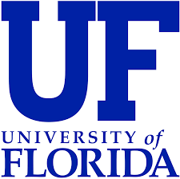
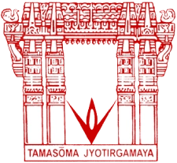

## University Of Florida
- *Masters in Computer Science - GPA 3.59/4* | Jan'23 - Dec'24
- 
- Tags: Research
- Badges:
  - Master's [blue]
- List Items:
  - Analysis of Algorithms, Advanced Data Structures, Distributed Operating Systems, Advanced Computer Networks, Natural Language Processing, Computer and Information Security, Human Computer Interaction.

## VNR Vignana Jyothi Institute of Engineering and Technology
- *B.Tech in Computer Science and Engineering - GPA 8.71/10* | Aug'17 - Jul'21
- 
- Tags: Research
- Badges:
  - Bachelor's [blue]
- List Items:
  - Database Management System, Data Structures and Algorithms,Computer Networks, Operating Systems, Automata Theory, Computer Architecture, Java, C++.

<!-- ## Company 3
- *Role* | Mar'23 - Apr'23
- 
- Tags: Category 3
- Badges:
  - Badge [blue]
- List Items:
  - Point 1
  - Point 2 -->