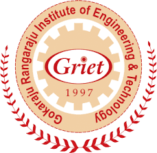

## University Of Florida
- *Masters in Computer Science - GPA 3.18/4* | Jan'23 - Dec'24
- 
- Tags: Research
- Badges:
  - Master's [blue]
- List Items:
  - Analysis of Algorithms, Advanced Data Structures, Distributed Operating Systems, Advanced Computer Networks, Natural Language Processing, Computer and Information Security, Human Computer Interaction.

## Gokaraju Rangaraju Institute of Engineering and Technology
- *B.Tech in Computer Science and Engineering - GPA 9.53/10* | Aug'16 - Sep'20
- 
- Tags: Research
- Badges:
  - Bachelor's [blue]
- List Items:
  - Database Management System, Data Structures and Algorithms,Computer Networks, Operating Systems, Automata Theory, Computer Architecture, Java, C++.

