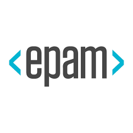

## University Of Florida - IFAS
- *Software Engineer* | Apr'23 - Present
- 
- Tags: Research
- Badges:
  - Research [blue]
- List Items:
  - Designed and implemented a sophisticated architecture for determining the best chemicals for plant growth in diverse environments and soil types, utilizing genomic and phenotypic data.
  - Leveraged Python's MPI and CUDA-enabled GPUs to achieve a 40% reduction in processing time for parallel data tasks.
  - Integrated advanced optimization techniques such as Nelder-Mead, easyPheno, and Particle Swarm Optimization, improving precision by 20% and boosting overall model performance by 25%.
  - Extracted and visualized chemical parameters using Python, R, Seaborn, and Tableau, leading to deeper insights and enhancing data-driven research outcomes.

## Epam Systems
- *Software Development Engineer* | Oct'21 - Dec'22
- 
- Tags: Full Time
- Badges:
  - Full Time [blue]
- List Items:
  - Engaged as a full-stack developer, contributing to the development and maintenance of internal applications for Google Maps, involving both front-end and back-end tasks, and collaborating with a cross-functional team to increase the optimal functionality and user experience of the applications.
  - Migrated legacy SOAP APIs to REST APIs and developed new RESTful APIs using Spring Boot and Java, implementing a microservices architecture. This transition contributed to a 32% reduction in latency, enhancing overall system performance.
  - Developed plugins for data collection used for maps with Python, Google Colab, and Protocol Buffers.
  - Designed, developed, and maintained highly scalable and low-latency RESTful and gRPC-based Java microservices from scratch, capable of processing large files and facilitating a secure approval workflow.
  - Developed comprehensive unit test cases using JUnit and Mockito, leading to a substantial improvement in code coverage by 41%.
  - Worked closely with DevOps teams to manage deployment on GCP using Docker containers and Kubernetes clusters, achieving a 10% reduction in deployment times and significantly improving system scalability, resilience, and resource allocation.
  - Played a significant part in mentoring and providing advice to interns, conducting code reviews that resulted in a 23% decrease in the number of bugs and a noticeable improvement in overall code readability.

## Epam Systems
- *Software Development Engineer Intern* | May'21 - Sep'21
- 
- Tags: Internship
- Badges:
  - Internship [blue]
- List Items:
  - Engaged collaboratively in an agile framework with cross-functional teams, actively participating in 100% of daily scrum sessions.
  - Implemented key features as part of the development of EPAM’s internal Refer Portal application, improving referral process efficiency by 15%, which resulted in a 10% increase in user engagement and faster referral tracking.
  - Participated in Agile-driven SDLC iterations, gaining hands-on experience in iterative development, continuous integration, and responsive adaptation to changing project requirements.