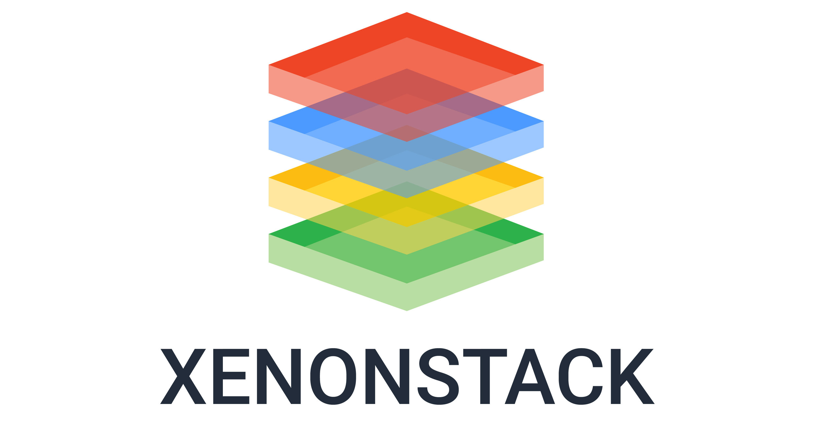

## IBM
- *Software Engineer in Test* | Jan'21 - Oct'22
- 
- Tags: Full Time
- Badges:
  - Full Time [blue]
- List Items:
  - Led Data Lake Decommission and Migration for TRUIST Bank, preparing test data and mockups for multiple teams, resulting in seamless data migration.
  - Executed Data Loading and Table Validations using Microsoft SQL Server Studio, ensuring 100% table validation and data integrity.
  - Developed and Executed ETL Test Cases in Hive environments (SIT, UAT) using tools like Hue-Editor, TOAD Datapoint, and DBeaver, improving data quality assurance by 15%.
  - Automated Manual Admin Module Processes in collaboration with the development team, achieving a 25% improvement in time efficiency, enhancing scalability, reliability, and consistency.
  - Created Custom Scripts for end-to-end testing of back-end processing systems and front-end GUIs, ensuring a 93% on-time completion rate for defect-free releases in a Scrum Agile environment.
  - Maintained Continuous Communication with internal teams (BA, Scrum, developers) throughout the SDLC, achieving a 96% success rate in regression and functional test execution within QA test environments prior to Production release and System integration test cycles.
  - Collaborated with Test Lead and Manager to optimize UI/API automation scripts, resolving technical issues and achieving a 30% reduction in automation execution time, driving continuous improvement.

## XenonStack
- *Software Engineer Intern* | Jul'18 - Sep'18
- 
- Tags: Internship
- Badges:
  - Internship [blue]
- List Items:
  - Engineered over 20 automation scripts using object-oriented principles in Java, optimizing code reliability by 20% through the use of Eclipse IDE and unit testing frameworks, including JUnit and TestNG.
  - Improved testing efficiency and accuracy by 60% for latency tests through comprehensive test suites and YAML configuration files.