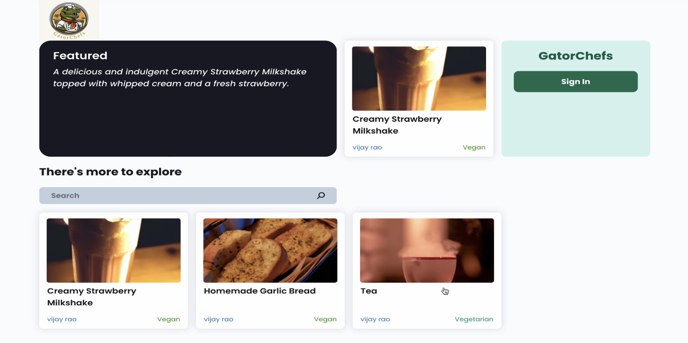
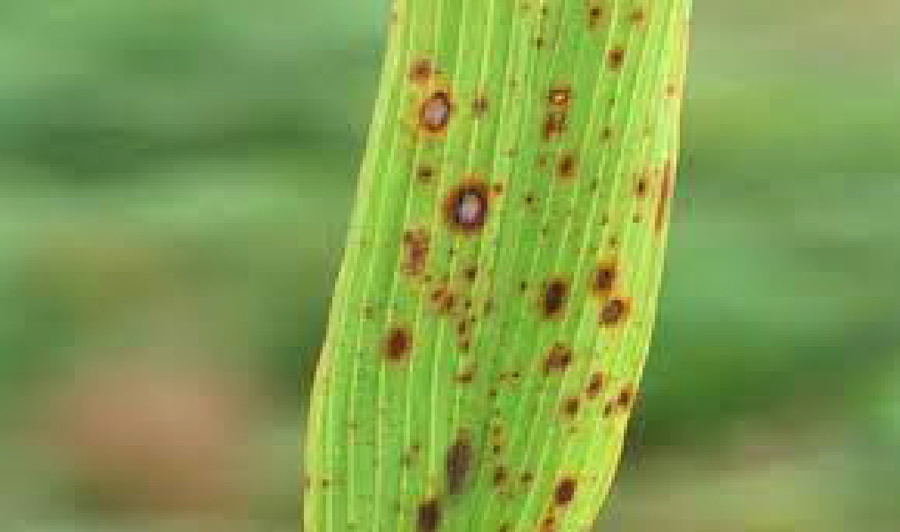

## GatorChefs - Recipe sharing tool
Description
- 
- Tags: Web Development
- Badges:
  - ReactJs, NodeJs, MongoDB, CloudFlare, OpenAI [blue]
- Buttons:
  - Link [https://github.com/saisanthosh9652/GatorChefs]
- Description1
  - Developed a full-stack web application, reducing recipe sharing time by 50% by automating key tasks such as recipe descriptions and ingredient categorization using OpenAI SDK, integrated with React, Node.js, and MongoDB.
  - Achieved 95% user authentication success rate through Clerk integration, and optimized image serving speed by 30% using Cloudflare Images, ensuring seamless performance across major desktop and mobile browsers.
  - Enhanced community safety by implementing AI-powered spam filtration, allergen detection, and health insights, improving content accuracy and safety by 40%.

## Vaccine Management System
Description
- 
- Tags: Web Development
- Badges:
  - Java, Spring Boot, JPA Hibernate, Spring cloud config, Junit, Angular [blue]

- Description1
  - Designed and implemented a microservice-based architecture with separate services for user management and vaccine management, connected via Netflix Eureka for service discovery.
  - Utilized Spring Cloud Config for real-time configuration updates and Spring Gateway to implement a gateway for accessing the core application.
  - Built with Angular for the frontend, and JPA Hibernate for data persistence, ensuring thorough testing with JUnit and Mockito for backend reliability.

## GatorTaxi
Description
- 
- Tags: Web Development
- Badges:
  - Java, bash, Hipergator [blue]

- Description1
  - Architected a ride-sharing program in java employing Red-Black Trees and Min-Heaps, achieving logarithmic time complexity (O(log N) to enhance system speed by 20% and ensure seamless customer experience.
  - This resulted in a 50% improvement in ride-matching speeds and a 40% increase in overall system throughput.
  - Optimized ride request management with custom RBT and Min-Heap, yielding a 43% performance boost while synchronizing data structures for efficient ride-sharing services.

## Detection of Leaf diseases using CNN
Description
- 
- Tags: Machine Learning
- Badges:
  - Python, Django, Angular, Keras, TensorFlow [blue]

- Description1
  - Conducted detailed EDA to identify intricate relationships between dataset features, uncovering patterns and insights for model development.
  - Developed a machine learning model and a fully functional website using Angular and Django for early-stage leaf disease detection, leveraging CNNs to achieve a 32% accuracy improvement.