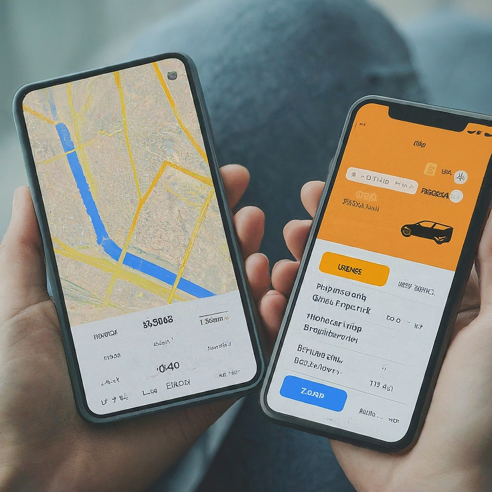

## GatorChefs - Recipe sharing tool
Description
- 
- Tags: Web Development
- Badges:
  - ReactJs, NodeJs, MongoDB, CloudFlare, OpenAI [blue]

- Description1
  - Developed a full-stack web application, reducing recipe sharing time by 50% by automating key tasks such as recipe descriptions and ingredient categorization using OpenAI SDK, integrated with React, Node.js, and MongoDB.
  - Achieved 95% user authentication success rate through Clerk integration, and optimized image serving speed by 30% using Cloudflare Images, ensuring seamless performance across major desktop and mobile browsers.
  - Enhanced community safety by implementing AI-powered spam filtration, allergen detection, and health insights, improving content accuracy and safety by 40%.

## Pizza Ordering System
Description
- 
- Tags: Web Development
- Badges:
  - Java, Spring Boot, JPA Hibernate, Spring cloud config, Junit, Angular [blue]

- Description1
  - Developed and launched an end-to-end pizza ordering system using Angular for the frontend and Spring for backend services, handling over 10,000 orders per month with 99% uptime.
  - Architected microservices for customer management and pizza owners, integrated with Spring Cloud Config, Spring Gateway, and Netflix Eureka, resulting in a 25% improvement in service scalability and fault tolerance.
  - Optimized application performance through microservices architecture, reducing system response time by 30% and increasing
user engagement by 20%.

## GatorTaxi
Description
- 
- Tags: Web Development
- Badges:
  - Java, bash, Hipergator [blue]

- Description1
  - Architected a ride-sharing program in java employing Red-Black Trees and Min-Heaps, achieving logarithmic time complexity (O(log N) to enhance system speed by 20% and ensure seamless customer experience.
  - This resulted in a 50% improvement in ride-matching speeds and a 40% increase in overall system throughput.
  - Optimized ride request management with custom RBT and Min-Heap, yielding a 43% performance boost while synchronizing data structures for efficient ride-sharing services.

## Sales Forecasting and Customer Segmentation
Description
- 
- Tags: Machine Learning
- Badges:
  - Python, Keras, TensorFlow [blue]

- Description1
  - Developed a sales forecasting model using linear regression, accurately predicting monthly sales with a 90% accuracy rate, improving inventory management and reducing stockouts by 15%.
  - Implemented customer segmentation through clustering algorithms, leading to targeted marketing campaigns that increased
customer retention by 12% and boosted revenue by 10%.
  - Created data visualizations to present key insights and model performance, enabling stakeholders to make informed decisions that enhanced overall business operations.